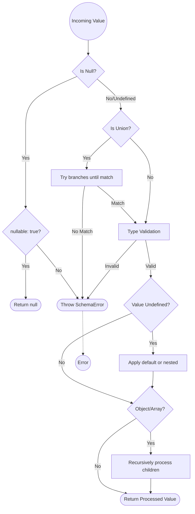

# Schema — Validation and Processing

This document describes the `Schema` class (see `src/schema/Schema.ts`) and how to create and use schemas generated from plain objects. It focuses on creating schemas via the constructor and `Schema.fromObject()`, defining simple and composite properties, handling defaults and nullability, processing full and partial data, error handling, JSON Schema export, and TypeScript inference utilities.

## Overview

`Schema` is a TypeScript-first runtime validation and processing helper. It provides:

- A compact property definition language (string, number, boolean, object, array, unions).
- Utilities to convert to JSON Schema.
- Methods to process runtime data (apply defaults, validate types, handle optional/required fields).
- Support for partial updates with dot-path navigation.
- TypeScript inference helpers exposed through `infer` and `inferToProcess` getters.

The implementation validates input using `Validator` and throws `SchemaError` for validation failures.

## Creating a Schema

There are two primary ways to instantiate a `Schema`:

- Direct constructor: `new Schema(rootProperty)` where `rootProperty` is a `Schema.Property` or `Schema.MultiProperty`.
- Helper from plain object: `Schema.fromObject(properties, allowAdditionalProperties?)` — creates a root object schema with the provided properties map.

Example (runtime):

```ts
import Schema from 'src/schema/Schema';

const schema = Schema.fromObject({
	name: { type: 'string', required: true },
	age: { type: 'number', default: 18 },
}, true);
```

The optional second argument to `fromObject` sets `allowAdditionalProperties` on the root object.

## Property Types and Definitions

Property definitions follow the `Schema.Definition.*` shapes. Key aspects:

| Attribute    | Type      | Description |
| :---         | :---      | :--- |
| `type`       | `string`  | Defines the base type (`object`, `array`, `string`, `number`, `boolean`). |
| `nullable`   | `boolean` | If `true`, allows explicit `null` values. |
| `required`   | `boolean` | If `true`, the field must be present (or have a `default`). |
| `default`    | `any`     | Value applied if input is `undefined`. |
| `unique`     | `boolean` | Marks the field for uniqueness constraint. |

- `string`: may include `enum`, `pattern` (RegExp), `minLength`, `maxLength`.
- `number`: may include `minimum`, `maximum`.
- `boolean`: simple true/false value, can be combined with `required`, `nullable`, `default`, `unique`.
- `object`: may include `properties` (a property map) and `allowAdditionalProperties`.
- `array`: `items` is the element property definition and you can set `minimum`/`maximum` lengths.


```ts
type Model = typeof schema.infer;
type Input = typeof schema.inferToProcess;
```

## Processing Data

Two primary processing methods:

- `processData(data, partial?)` — Validate and process a complete (or partially flagged) value against the full schema. It returns the processed value with defaults applied, validated types, nested processing for objects/arrays and union resolution. If `partial` is true it relaxes required checks for update-style operations.
- `processPartialData(data)` — Intended to validate partial update payloads. Supports dot-notation keys (e.g., `user.address.street`) and will process only the keys present in the input, respecting open objects (objects without a `properties` map) and union branches.


> [!IMPORTANT]
> **allowAdditionalProperties behavior:**
> 
> - `true`: Keep extra keys (they are allowed but not validated).
> - `false`: Throw `SchemaError` if any extra key is present (strict mode).
> - `undefined` (default): Silently filter out extra keys (only defined properties and defaults are returned).

- When an incoming value is `undefined` or `null`, `processProperty` will either apply defaults, return `null` (if `nullable`), or throw `SchemaError` for missing required properties.
- For `union` properties, the implementation tries each union branch and uses the first that validates.
- Object processing will iterate defined properties and process each one. See above for how additional/unknown keys are handled.

Example usage:

```ts
const input = { name: 'Alice' };
const output = schema.processData(input); // age default applied -> { name: 'Alice', age: 18 }

const patch = { 'address.city': 'Madrid' };
const partial = schema.processPartialData(patch);
```

## Partial Updates and Path Navigation

`processPartialData` uses `navigatePath(path: string)` to resolve dot-paths into schema properties. `navigatePath` supports:

- Resolving through unions (it searches for an object branch that contains the requested sub-property).
- Detecting open objects (object definitions without `properties`) and returning an `isOpen` flag so callers know the final property is open-ended.

When a partial key points at an open object, the value is not processed (it is returned as-is) and allowed to pass through.

## Defaults Application

`applyDefaults(prop, key)` computes the runtime default for a property when the incoming data is missing. Rules:

- If `default` is set on the property, use it.
- For union properties, attempt to compute defaults for each branch and return the first that succeeds. If no branch matches and property is `nullable`, return `null`.
- For an object with `properties`, recursively compute defaults for its child properties and return an object with the computed defaults.

If a required property (without default) is missing, `applyDefaults` throws `SchemaError`.

## Error Handling

All validation and processing failures raise `SchemaError` with a helpful message indicating the failing property and reason. Typical error conditions:

- Type mismatch (string vs number, array expected, etc.).
- Missing required fields during processing (unless `partial` rules apply).
- Unknown properties when `allowAdditionalProperties` is `false`.
- No matching union branch for a value.

## JSON Schema Export

`toJsonSchema()` and the `jsonSchema` getter produce a JSON Schema representation by delegating to `Introspection.toJsonSchema(...)`. This is useful for interoperability with other tools or for generating documentation and validation schemas for clients.

## Unique Keys

`uniques` collects property keys flagged with `unique: true` (delegates to `Introspection.listUniques(...)`). This is helpful for higher-level workflows that need to enforce uniqueness constraints in persistence layers.

## Public API Reference

- `constructor(root: Schema.Property | Schema.MultiProperty)` — Create a `Schema` instance from a root property.
- `static fromObject<T extends Schema.PropertyMap>(obj: T, allowAdditionalProperties?: boolean)` — Helper creating an object root schema.
- `processData(data, partial?: boolean)` — Validate and process runtime data.
- `processPartialData(data)` — Validate and process a partial update payload (supports dot-path keys).
- `jsonSchema` / `jsonSchemaJSON` — JSON Schema object and JSON string.
- `uniques` — List of unique keys found in the schema.

## Examples

1) Creating and processing a simple object:

```ts
const user = Schema.fromObject({
	id: { type: 'string', required: true, unique: true },
	name: { type: 'string' },
	age: { type: 'number', default: 21 },
});

const valid = user.processData({ id: 'u1', name: 'Alice' });
// => { id: 'u1', name: 'Alice', age: 21 }
```

2) Processing a partial update:

```ts
const partial = user.processPartialData({ 'name': 'Bobby' });
// => { name: 'Bobby' }

const nestedSchema = Schema.fromObject({ profile: { type: 'object', properties: {
	address: { type: 'object', properties: { city: { type: 'string' } } }
}}});

const patch = nestedSchema.processPartialData({ 'profile.address.city': 'Madrid' });
// => { 'profile.address.city': 'Madrid' } (processed only for present keys)
```

## Recommendations and Notes

- Prefer `fromObject` for readable schema definitions.
- Use `infer` and `inferToProcess` for strong typing in TypeScript code.
- When designing APIs, use `processPartialData` for PATCH-style update validations.
- Keep `allowAdditionalProperties` explicit to avoid accidental data acceptance.

## See also

- Source implementation: [src/schema/Schema.ts](src/schema/Schema.ts#L1)
- Validator: [src/schema/Validator.ts](src/schema/Validator.ts#L1)
- JSON Schema conversion: [src/schema/Introspection.ts](src/schema/Introspection.ts#L1)

---

## Lifecycle

The following lifecycle describes the ordered operations performed by `processData` / `processProperty` when validating and processing a value.

1. Check Nullability: If the incoming value is `null`, return `null` only when the property is marked `nullable: true`; otherwise throw `SchemaError`.
2. Union Resolution: If the property is a union (`union`), try each branch in order and select the first branch that successfully validates the value.
3. Type Validation: Validate the value type (string, number, boolean, array, object) using `Validator` helpers.
4. Defaults Application: If the value is `undefined`, attempt to apply defaults (`default`) or compute nested defaults; if required and no default, throw `SchemaError` (unless `partial` relaxes required checks).
5. Nested Processing: For container types (object/array), recursively process children: arrays map items through `processProperty`; objects iterate defined properties and process each child property.
6. Finalize: Return the processed value (with defaults and nested results applied) or propagate errors.

Mermaid diagram:



If you want, I can expand this file with extended examples, add small runnable snippets, or include a quick reference table mapping schema definition keys to validation behavior.
